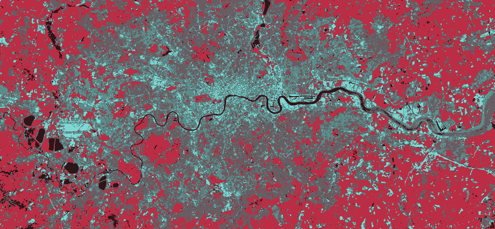

# ISODATA 影像分类器
使用 ISODATA 算法对影像像素进行分类。

## Functions
使用 ISODATA（迭代自组织数据分析算法）对影像像素进行分类，并生成结果图像。

仅为算法的实现，运行速度极慢，没有实用价值。

## Requirements
### Environment and Packages
* Python 3
* [Pillow](http://python-pillow.org "Pillow")
* [NumPy](http://www.numpy.org "numpy")
* [matplotlib](https://matplotlib.org "matplotlib")

### File
| Filename | Description
| :------- | :----------
| `*.*`    | 源图像文件（可被 Pillow 解析的格式）

## Useage
本工具需要通过命令行参数使用。

### Command Line Option List
| Long Opt / Opt | Args         | Note
| :------------- | :----------- | :---
| `--input`      | `<filename>` | 源图像文件名
| `--output`     | `<filename>` | 输出图像文件名
| `--rgb`        |              | 以彩色进行分类（更慢）
| `--gray`       |              | 以灰度图进行分类（默认）
| `--K`          | `<number>`   | 类别数（期望）（默认为3）
| `--TN`         | `<number>`   | 每个类别中样本最小数目（期望）（默认为3）
| `--TS`         | `<number>`   | 每个类别的标准差（默认为4.0）
| `--TC`         | `<number>`   | 每个类别间的最小距离（默认为40）
| `--L`          | `<number>`   | 每次允许合并的最大类别对的数量（默认为10）
| `--I`          | `<number>`   | 允许迭代的次数上限（默认为8）
| `--help` `-h`  |              | 显示帮助文本

## Experiment Report
### 验证
首先应当验证核心算法和代码，包括以下两步：
1. 在搭建好程序框架后，先按照算法说明编写处理灰阶图像（即单一分量）的函数 `doISODATAGray()`，将灰阶差作为颜色距离处理
2. 制作灰阶测试图像，运行程序并修正错误，根据输出结果调整参数，验证代码的正确性

在处理灰阶图像的函数代码基础上编写处理彩色图像（R、G、B 三个分量）的函数 `doISODATARGB`。

制作彩色测试图像，运行程序并修正错误，根据输出结果调整参数，验证代码的正确性。测试的参数和结果如下：

| 输入图像 | 输出图像 | 参数 | 运行结果
| :---: | :---: | :--- | :--- |
|  |  |   | 迭代4次 分为4类 |
|  |  |   | 迭代6次 分为4类 |

结果基本符合预期，可见核心算法和代码没有问题。

用实际遥感影像进行测试，结果如下：

期望分为4类，实际分为5类

*原始图片来源：[MSc Remote Sensing and Environmental Mapping - UCL Depertment of Geography](http://www.geog.ucl.ac.uk/study/graduate-taught/msc-remote-sensing-and-environmental-mapping)*

可见结果图片大部分符合预期，但河流下游的河道中央处明显存在错误分类。

### 进一步的讨论
虽然基本算法和代码没有问题，但实际上几乎没有实用性可言，目前存在的问题有如下几点：
1. 运行效率和运算速度极低，应当对代码进行优化，例如重分类时可以利用多线程及一些特定情况下（如合并之后重分类）的算法提高计算效率。
2. 对彩色图片的处理中，本程序使用RGB空间中的优化欧式距离[1](#reference)作为颜色差异的度量：  
  
但实际上这种方法并不可取，在使用实际照片进行分类时结果非常不理想，应当先转换至 HSI 等基于视觉感受的色彩空间再进行分类。
3. 在处理实际照片（非遥感影像图，而是用手机等拍摄的照片）时输出的图片分类颜色可能与原图差异很大，但用测试图片的输出符合预期，原因是原图中有阴影导致同一聚类中像素颜色分散，输出时则直接输出了各个聚类的中心颜色，更好的解决方法是输出每个聚类的众数值或距离中心最近的像素颜色。

## Changelog
### [0.1.3] - 2018-06-03
#### Added
- 运行时输出更多状态

### [0.1.2] - 2018-05-29
#### Added
- 合并和分裂时显示结果

### [0.1.1] - 2018-05-27
#### Fixed
- 彩色分类的一些算法错误

### [0.1.0] - 2018-05-13
- 首个基础功能完整的版本

## Licence
本工具基于 [MIT 协议](./LICENSE)。

## Reference
1. [Color difference - Wikipedia](https://en.wikipedia.org/wiki/Color_difference)
